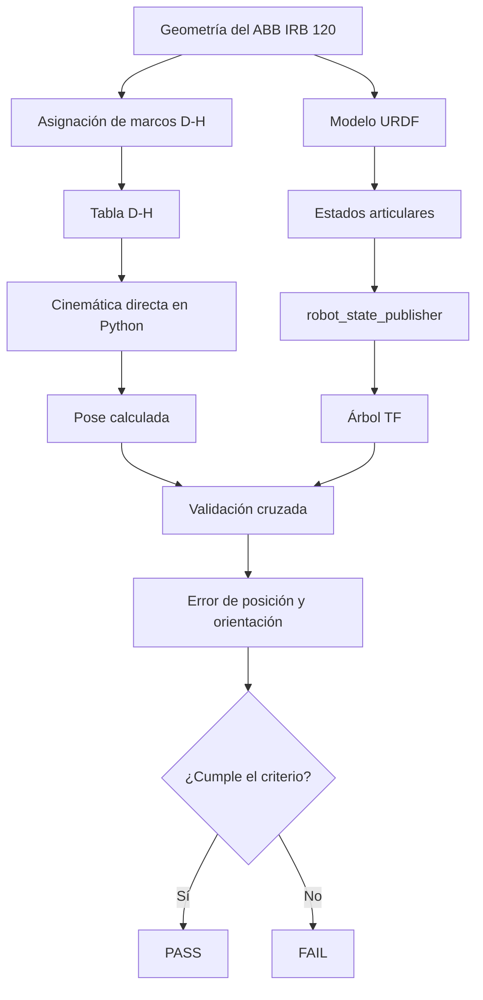
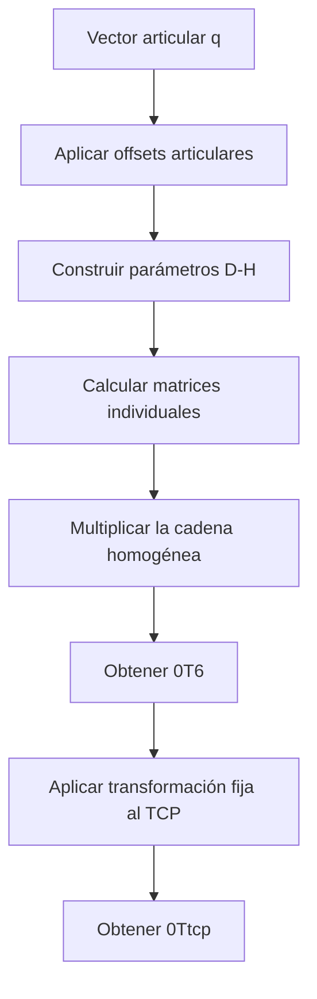
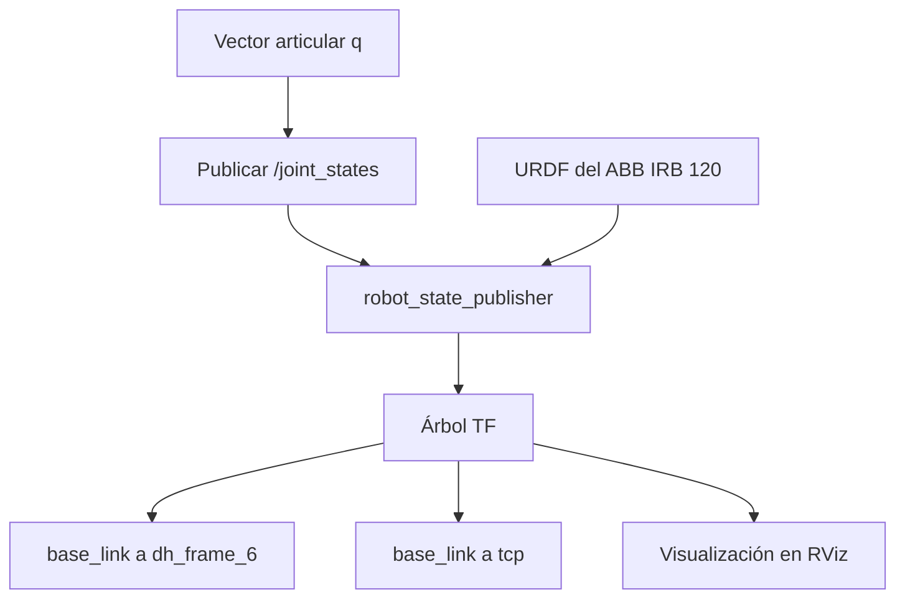
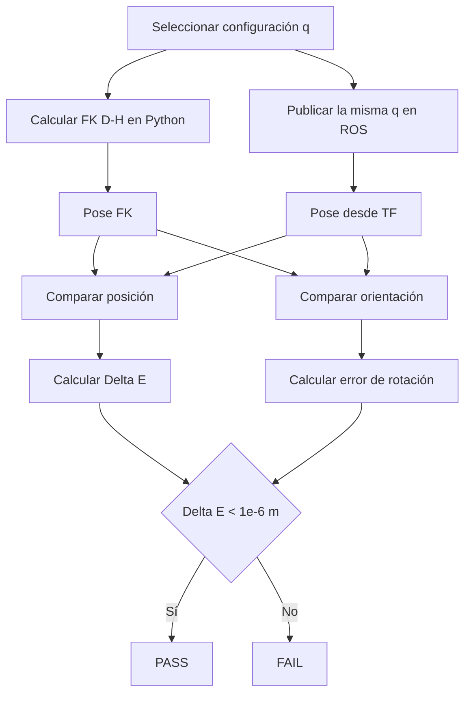

# Diagramas de flujo — Hito 1 ABB IRB 120

Este documento resume únicamente los procesos técnicos del Hito 1.

---

## 1. Flujo general del Hito 1

---

## 2. Flujo de cinemática directa D-H

---

## 3. Flujo URDF / ROS

---

## 4. Flujo de validación FK vs ROS

