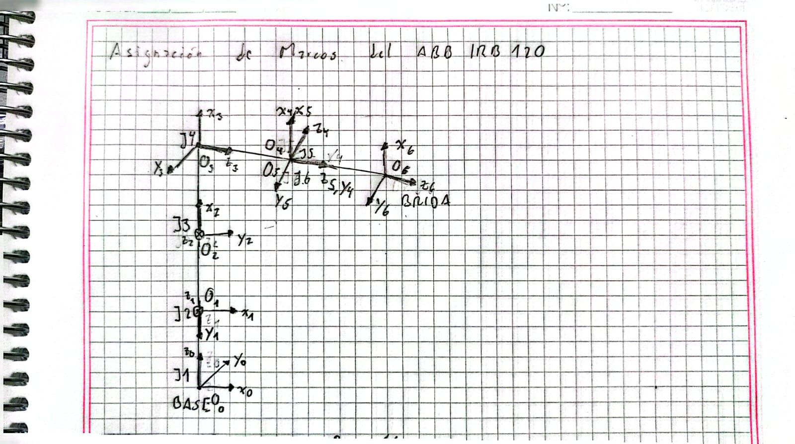

# Asignación de Marcos D-H — ABB IRB 120

## Marcos de referencia

La asignación de los marcos D-H para el ABB IRB 120 se representa mediante los marcos \(\{0\}\) a \(\{6\}\), asociados a las seis articulaciones del manipulador.

## Cadena de marcos

\[
\{0\}
\rightarrow
\{1\}
\rightarrow
\{2\}
\rightarrow
\{3\}
\rightarrow
\{4\}
\rightarrow
\{5\}
\rightarrow
\{6\}
\]

Los ejes \(z_i\) se asignan siguiendo los ejes de movimiento de las articulaciones.

## Parámetros geométricos

Los desplazamientos utilizados en la asignación corresponden al modelo D-H del ABB IRB 120:

\[
d_1 = 0.290\;m
\]

\[
a_2 = 0.270\;m
\]

\[
a_3 = 0.070\;m
\]

\[
d_4 = 0.302\;m
\]

\[
d_6 = 0.072\;m
\]
