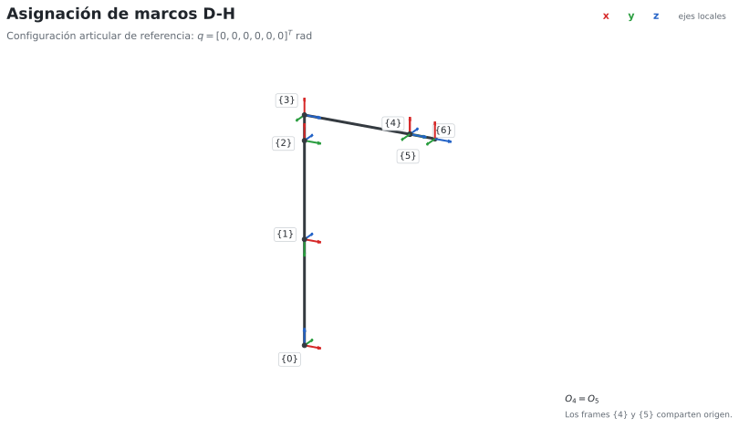
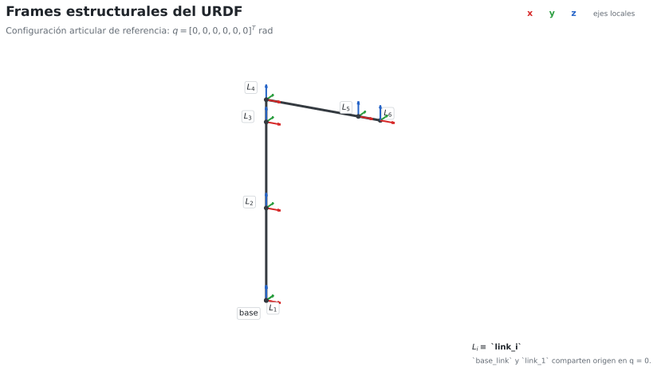
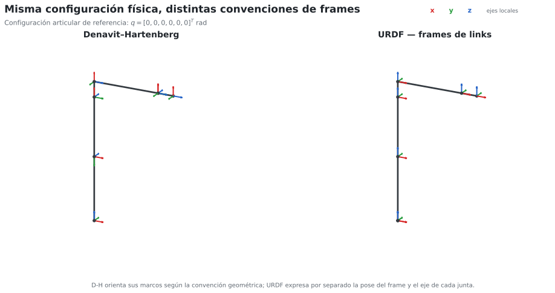
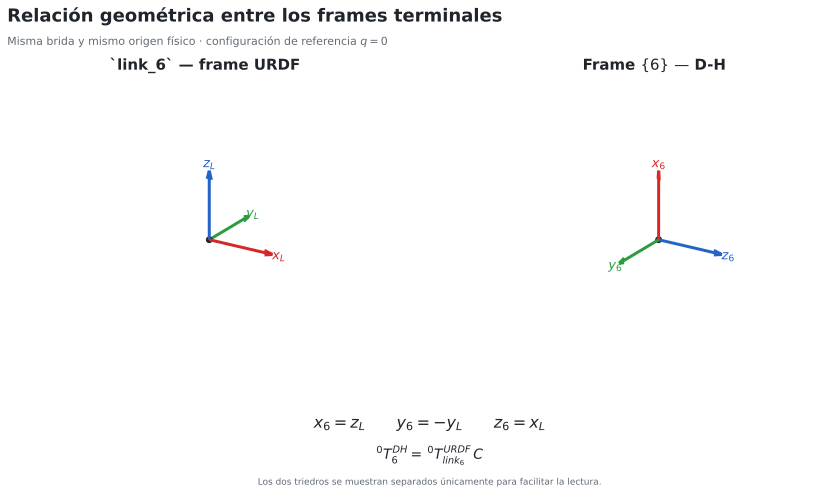

# Sustentación D-H ↔ URDF del ABB IRB 120

## Propósito

El objetivo es justificar por qué el modelo D-H y el URDF representan la misma cadena cinemática aunque sus sistemas de referencia no coincidan frame a frame.

El material del curso establece que la conversión D-H → URDF no es una copia directa de parámetros. D-H fija una convención geométrica para ubicar los marcos; URDF separa la pose fija de una junta (`origin`) de su eje de movimiento (`axis`).

## 1. Misma configuración articular

La comparación se realiza usando la misma configuración física:

$$
q=[0,0,0,0,0,0]^T.
$$

Esto no implica que todos los ángulos D-H sean cero. En el modelo utilizado:

$$
\theta_2=q_2-\frac{\pi}{2},
$$

por lo que para `q=0` se tiene `θ2=-π/2`. Los ángulos `α_i` también permanecen presentes. Por eso los marcos D-H pueden aparecer rotados entre sí aun cuando todas las variables articulares sean cero.



## 2. Por qué los frames URDF se ven distintos

En D-H, el eje de actuación de la articulación `i` se asocia con `z_(i-1)`. En URDF, el eje se declara explícitamente mediante:

```xml
<axis xyz="..."/>
```

mientras que la pose fija entre parent y child se declara con:

```xml
<origin xyz="..." rpy="..."/>
```

Por eso no es necesario que:

$$
\{i\}_{DH}=\{link_i\}_{URDF}.
$$

Lo que debe coincidir es el movimiento físico generado por la misma `q` y, por tanto, la transformación terminal de la cadena.





## 3. Relación entre `link_6` y el frame D-H `{6}`

En la implementación actual, `link_6` y el frame D-H `{6}` llegan al mismo punto físico de la brida, pero usan orientaciones locales distintas.

Sea:

$$
{}^0T_6^{DH}
$$

la pose terminal obtenida por D-H y:

$$
{}^0T_{L}^{URDF},\qquad L=link_6
$$

la pose de `link_6` en URDF.

Como ambos frames están rígidamente unidos a la misma brida, existe una transformación fija `C` tal que:

$$
{}^0T_6^{DH}={}^0T_L^{URDF}C.
$$

Por tanto:

$$
\boxed{C=\left({}^0T_L^{URDF}\right)^{-1}{}^0T_6^{DH}}
$$

Esta ecuación permite obtener `C`; no se introduce de manera arbitraria.

## 4. Deducción geométrica de `C`

Al comparar ambos triedros terminales se obtiene:

$$
x_6=z_L,\qquad y_6=-y_L,\qquad z_6=x_L.
$$

Por tanto, las columnas de la rotación relativa son:

$$
R_C=
\begin{bmatrix}
0&0&1\\
0&-1&0\\
1&0&0
\end{bmatrix}.
$$

Como ambos frames comparten origen, la parte traslacional es cero:

$$
\boxed{
C=
\begin{bmatrix}
0&0&1&0\\
0&-1&0&0\\
1&0&0&0\\
0&0&0&1
\end{bmatrix}}
$$

Además:

$$
R_C^TR_C=I,\qquad \det(R_C)=1,
$$

por lo que se trata de una rotación válida.



## 5. Implementación en URDF

La rotación anterior puede representarse en URDF mediante:

$$
roll=0,\qquad pitch=-\frac{\pi}{2},\qquad yaw=\pi.
$$

Por eso se añadió el frame fijo `dh_frame_6`:

```xml
<joint name="link6_to_dh_frame_6" type="fixed">
  <parent link="link_6"/>
  <child link="dh_frame_6"/>
  <origin xyz="0 0 0"
          rpy="0 -1.5707963267948966 3.141592653589793"/>
</joint>
```

Este joint no agrega un grado de libertad. Sólo expresa dentro de TF la orientación del frame terminal D-H.

Así, la relación buscada es:

$$
\boxed{{}^0T_{dh\_frame\_6}^{ROS}(q)={}^0T_6^{DH}(q)}.
$$

## 6. Comprobación

El script `figuras/derivar_c.py` calcula `C` a partir de los dos modelos y comprueba que permanece constante en configuraciones distintas. La validación principal del Hito compara además la FK matemática con TF para las configuraciones A y B, obteniendo errores de posición muy inferiores al criterio académico:

$$
\Delta E<10^{-6}\text{ m}.
$$

## Conclusión

D-H y URDF no necesitan usar los mismos frames intermedios. La equivalencia se establece porque ambos representan la misma geometría y producen la misma pose terminal para la misma configuración articular.

La transformación fija `C` explica únicamente la diferencia de orientación entre `link_6` y el frame D-H `{6}` y permite realizar una comparación directa entre la FK analítica y ROS/TF.
